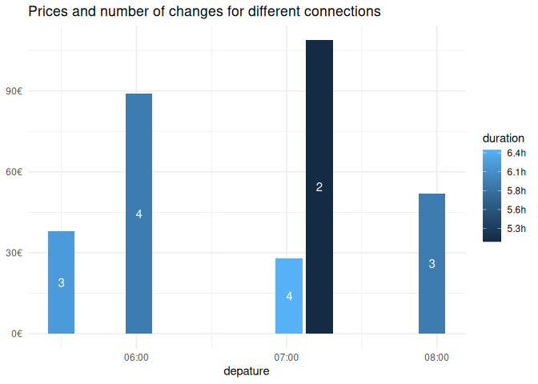
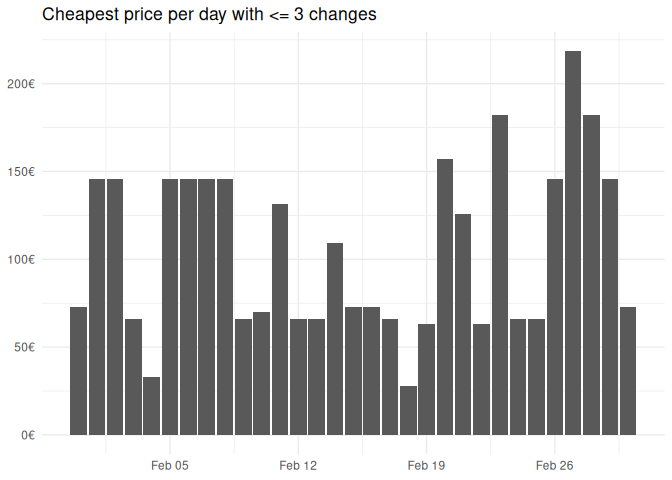

<!-- README.md is generated from README.Rmd. Please edit that file -->

# zugr

<!-- badges: start -->

[](https://lifecycle.r-lib.org/articles/stages.html#experimental)
<!-- badges: end -->

Just a small package that wraps the Fahrplan API of the German train
company [db](https://www.bahn.de). The main idea is to be able to cast
your net a bit wider in cases when you are flexible to go on a different
hour, day, or week.

> [!NOTE]
> I do not have time to actively develop this package. It
> should be seen as a prototype. If you want to take it over as
> maintainer to develop it further, [let me
> know](mailto:johannesb.gruber@gmail.com).

## Installation

You can install the development version of zugr like so (or with
`remotes`, but the cool kids use `pak` now :grin:):

``` r
# install.packages("pak)
pak::pak("JBGruber/zugr")
```

## Example: When should I go to Amsterdam

A journey that I take often is from Wiesbaden to Amsterdam. There are
really fast connections between these cities, which is awsome! What is
less great is trying to decide if I go Monday or Tuesday, on the weekend
or during the week, or if I should rather go in a different week? If
you’ve used the interface of [bahn.de](https://www.bahn.de), you know
these decisions require a lot of useless click-work. Well not anymore…

The first step is to get the station ID for the main stations in
Wiesbaden and Amsterdam:

``` r
library(zugr)
wi <- search_station("Wiesbaden HBF")
wi
#> # A tibble: 10 × 2
#>    name                   id                                                    
#>    <chr>                  <chr>                                                 
#>  1 Wiesbaden Hbf          A=1@O=Wiesbaden Hbf@X=8243729@Y=50070788@U=80@L=80002…
#>  2 Wiesbaden-Mainz-Kast   A=1@O=Wiesbaden-Mainz-Kast@X=8283173@Y=50006578@U=80@…
#>  3 Wiesbaden-Auringen-M   A=1@O=Wiesbaden-Auringen-M@X=8332092@Y=50113604@U=80@…
#>  4 Wiesbaden-Biebrich     A=1@O=Wiesbaden-Biebrich@X=8236420@Y=50048827@U=80@L=…
#>  5 Wiesbaden-Erbenheim    A=1@O=Wiesbaden-Erbenheim@X=8295048@Y=50054410@U=80@L…
#>  6 Wiesbaden Ost          A=1@O=Wiesbaden Ost@X=8256295@Y=50041411@U=80@L=80064…
#>  7 Wiesbaden-Igstadt      A=1@O=Wiesbaden-Igstadt@X=8325638@Y=50082582@U=80@L=8…
#>  8 Wiesbaden-Schierstein  A=1@O=Wiesbaden-Schierstein@X=8194602@Y=50047587@U=80…
#>  9 Wiesbaden-Chausseehaus A=1@O=Wiesbaden-Chausseehaus@X=8168794@Y=50097765@U=8…
#> 10 Wiesbaden-Biebr. KD    A=1@O=Wiesbaden-Biebr. KD@X=8236600@Y=50036234@U=80@L…
```

The first one is what I need! Now Amsterdam. Here I don’t need as many
options:

``` r
adam <- search_station("Amsterdam", n_res = 2)
adam
#> # A tibble: 2 × 2
#>   name                       id                                                 
#>   <chr>                      <chr>                                              
#> 1 Amsterdam Centraal         A=1@O=Amsterdam Centraal@X=4899427@Y=52379191@U=80…
#> 2 Amsterdam, Centaurusstraat A=2@O=Amsterdam, Centaurusstraat@X=4884163@Y=52414…
```

Now I can make a search for next Tuesday Morning (as of writing this):

``` r
next_tuesday <- bahn_search(
  from = wi$id[1],
  to = adam$id[1],
  start = "2024-02-06T05:00:00",
  end =  "2024-02-06T19:00:00"
)
next_tuesday
#> # A tibble: 28 × 6
#>    id         duration             price changes start              
#>    <chr>      <Duration>           <dbl>   <int> <dttm>             
#>  1 12f92732_3 16140s (~4.48 hours)  79.9       1 2024-02-06 05:00:00
#>  2 b5b084ea_3 20460s (~5.68 hours)  85.9       2 2024-02-06 05:48:00
#>  3 c2154884_3 17400s (~4.83 hours)  99.9       1 2024-02-06 06:39:00
#>  4 29be3e05_3 20820s (~5.78 hours)  57.9       3 2024-02-06 06:48:00
#>  5 8f800bd9_3 22620s (~6.28 hours)  37.9       4 2024-02-06 06:48:00
#>  6 03e0ebdd_3 20820s (~5.78 hours)  83.9       4 2024-02-06 07:18:00
#>  7 a5c4f48e_3 20460s (~5.68 hours)  78.9       2 2024-02-06 07:48:00
#>  8 705c73ef_3 17400s (~4.83 hours)  89.9       1 2024-02-06 08:39:00
#>  9 73acf6a5_3 20820s (~5.78 hours)  83.9       3 2024-02-06 08:48:00
#> 10 6a9b423e_3 22620s (~6.28 hours)  47.9       5 2024-02-06 08:48:00
#> # ℹ 18 more rows
#> # ℹ 1 more variable: end <dttm>
```

Note that the `end` parameter marks the time at which the train should
arrive at the latest, while `start` marks the earliest departure that
should be included in the results.

So what is the cheapest connection? Easy to see with some `R` commands
:smirk::

``` r
library(tidyverse)
next_tuesday |> 
  slice_min(price, n = 1) |> 
  select(-id)
#> # A tibble: 1 × 5
#>   duration             price changes start               end                
#>   <Duration>           <dbl>   <int> <dttm>              <dttm>             
#> 1 22620s (~6.28 hours)  37.9       4 2024-02-06 06:48:00 2024-02-06 13:05:00
```

With 5 connections and more than 6 hours, this is a rather terrible
connections. It is cheap though. Let’s see s quick visualisation
instead:

``` r
next_tuesday |> 
  # some connections include trains from different companies, the prices for
  # these are not included
  filter(!is.na(price),
         !duplicated(start),
         start < "2024-02-06 11:00:00") |> # exclude some connections for readability
  ggplot(aes(x = start, y = price, label = changes, fill = duration)) +
  geom_col() +
  geom_text(aes(y = price / 2), colour = "white") +
  scale_y_continuous(labels = function(x) paste0(x, "€")) +
  scale_fill_gradient(labels = function(x) paste0(round(x / 60 / 60, 1), "h")) +
  labs(x = "depature", y = NULL, 
       title = "Prices and number of changes for different connections") +
  theme_minimal()
```



With more data, this gets a little more interesting.

``` r
march <- bahn_search(
  from = wi$id[1],
  to = adam$id[1],
  start = "2024-03-01T00:00:00",
  end =  "2024-04-01T00:00:00"
)
```

Let’s see which days would be especially cheap:

``` r
march |> 
  mutate(date = as.Date(start)) |> 
  group_by(date) |> 
  slice_min(price, n = 1, with_ties = FALSE) |> 
  ggplot(aes(x = date, y = price)) +
  geom_col() +
  labs(x = NULL, y = NULL, 
       title = "Cheapest price per day") +
  scale_y_continuous(labels = function(x) paste0(x, "€")) +
  theme_minimal()
```


So I could get a train on any day in March for the price of 32.90€. This
is all nice, but let’s only take into account connections I would
actually consider:

``` r
march |> 
  filter(changes <= 2,
         hour(start) > 7) |> 
  mutate(date = as.Date(start),
         weekday = wday(start, label = TRUE)) |> 
  group_by(date) |> 
  slice_min(price, n = 1, with_ties = FALSE) |> 
  ggplot(aes(x = date, y = price, label = weekday)) +
  geom_col() +
  geom_text(hjust = 0, angle = 90) +
  labs(x = NULL, y = NULL, 
       title = "Cheapest price per day with <= 2 changes and after 7am") +
  scale_y_continuous(labels = function(x) paste0(x, "€")) +
  theme_minimal()
```



It also looks like historic searches are possible.

``` r
historic <- bahn_search(
  from = wi$id[1],
  to = adam$id[1],
  start = "2024-01-22T05:00:00",
  end =  "2024-01-22T19:00:00",
  parse = FALSE
)
```

I do not parse the results here to be able to explore the data a bit
more (parsing only extracts the information that I found interesting on
first glance). However, the results contain a message that the
connection is in the past and information about price and demand seem
absent.

``` r
historic[[1]][["verbindungen"]][[1]][["meldungenAsObject"]][[1]][["nachrichtLang"]]
#> [1] "Die gewählte Verbindung liegt in der Vergangenheit"
```
