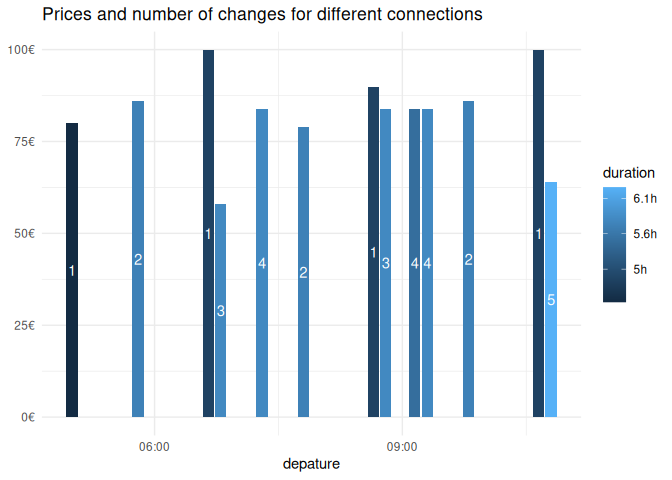

<!-- README.md is generated from README.Rmd. Please edit that file -->

# zugr

<!-- badges: start -->

[](https://lifecycle.r-lib.org/articles/stages.html#experimental)
<!-- badges: end -->

Just a small package that wraps the Fahrplan API of the German train
company [db](https://www.bahn.de). The main idea is to be able to be
able to cast your net a bit wider in cases when you are flexible to go
on a different hour, day, or week.

## Installation

You can install the development version of zugr like so (or with
`remotes`, but the cool kids use `pak` now :grin:):

``` r
# install.packages("pak)
pak::pak("JBGruber/zugr")
```

## Example: When should I go to Amsterdam

A journey that I take often is from Wiesbaden to Amsterdam. There are
really fast connections between these cities, which is awsome! What is
less great is trying to decide if I go Monday or Tuesday, on the weekend
or during the week, or if I should rather go in a different week? If
you’ve used the interface of [bahn.de](https://www.bahn.de), you know
these decisions require a lot of useless click-work. Well not anymore…

The first step is to get the station ID for the main stations in
Wiesbaden and Amsterdam:

``` r
library(zugr)
wi <- search_station("Wiesbaden")
wi
#> # A tibble: 10 × 2
#>    name                   id                                                    
#>    <chr>                  <chr>                                                 
#>  1 Wiesbaden Hbf          A=1@O=Wiesbaden Hbf@X=8243729@Y=50070788@U=80@L=80002…
#>  2 Wiesbaden-Mainz-Kast   A=1@O=Wiesbaden-Mainz-Kast@X=8283173@Y=50006578@U=80@…
#>  3 Wiesbaden-Auringen-M   A=1@O=Wiesbaden-Auringen-M@X=8332092@Y=50113604@U=80@…
#>  4 Wiesbaden-Erbenheim    A=1@O=Wiesbaden-Erbenheim@X=8295048@Y=50054410@U=80@L…
#>  5 Wiesbaden Ost          A=1@O=Wiesbaden Ost@X=8256295@Y=50041411@U=80@L=80064…
#>  6 Wiesbaden-Biebrich     A=1@O=Wiesbaden-Biebrich@X=8236420@Y=50048827@U=80@L=…
#>  7 Wiesbaden-Igstadt      A=1@O=Wiesbaden-Igstadt@X=8325638@Y=50082582@U=80@L=8…
#>  8 Wiesbaden-Schierstein  A=1@O=Wiesbaden-Schierstein@X=8194602@Y=50047587@U=80…
#>  9 Wiesbaden-Chausseehaus A=1@O=Wiesbaden-Chausseehaus@X=8168794@Y=50097765@U=8…
#> 10 Wiesbaden-Biebr. KD    A=1@O=Wiesbaden-Biebr. KD@X=8236600@Y=50036234@U=80@L…
```

The first one is what I need! Now Amsterdam. Here I don’t need as many
options:

``` r
adam <- search_station("Amsterdam", n_res = 1)
#> Waiting 11s for throttling delay ■■■
#> Waiting 11s for throttling delay ■■■■■
#> Waiting 11s for throttling delay ■■■■■■■■■■■■■
#> Waiting 11s for throttling delay ■■■■■■■■■■■■■■■■■■■■■■
#> Waiting 11s for throttling delay ■■■■■■■■■■■■■■■■■■■■■■■■■■■■■■
#> Waiting 11s for throttling delay ■■■■■■■■■■■■■■■■■■■■■■■■■■■■■■■
adam
#> # A tibble: 1 × 2
#>   name                         id                                               
#>   <chr>                        <chr>                                            
#> 1 Amsterdam Airport (Schiphol) A=1@O=Amsterdam Airport (Schiphol)@X=4761487@Y=5…
```

Now I can make a search for next Tuesday Morning (as of writing this):

``` r
next_tuesday <- bahn_search(
  from = wi$id[1],
  to = adam$id[1],
  start = "2023-10-03T05:00:00",
  end =  "2023-10-03T19:00:00"
)
#> Waiting 12s for throttling delay ■■■■■■
#> Waiting 12s for throttling delay ■■■■■■■■■■■■■■
#> Waiting 12s for throttling delay ■■■■■■■■■■■■■■■■■■■■■
#> Waiting 12s for throttling delay ■■■■■■■■■■■■■■■■■■■■■■■■■■■■■
#> Waiting 12s for throttling delay ■■■■■■■■■■■■■■■■■■■■■■■■■■■■■■■
#> ⠙ Getting results 1 done (0.066/s) | 15.2s
#> Waiting 9s for throttling delay ■■■■■■■
#> Waiting 9s for throttling delay ■■■■■■■■■■■■■■■■■
#> Waiting 9s for throttling delay ■■■■■■■■■■■■■■■■■■■■■■■■■■■■
#> Waiting 9s for throttling delay ■■■■■■■■■■■■■■■■■■■■■■■■■■■■■■■
#> ⠙ Getting results 1 done (0.066/s) | 15.2sWaiting 10s for throttling delay ■■■■                            
#> Waiting 10s for throttling delay ■■■■■■■■■■                      
#> Waiting 10s for throttling delay ■■■■■■■■■■■■■■■■■■■             
#> Waiting 10s for throttling delay ■■■■■■■■■■■■■■■■■■■■■■■■■■■■    
#> Waiting 10s for throttling delay ■■■■■■■■■■■■■■■■■■■■■■■■■■■■■■■ 
#> ⠙ Getting results 1 done (0.066/s) | 15.2s⠹ Getting results 3 done (0.078/s) | 38.5s
#> Waiting 9s for throttling delay ■■■■■■■■■■                      
#> Waiting 9s for throttling delay ■■■■■■■■■■■■■■■■■■■■            
#> Waiting 9s for throttling delay ■■■■■■■■■■■■■■■■■■■■■■■■■■■■■■  
#> Waiting 9s for throttling delay ■■■■■■■■■■■■■■■■■■■■■■■■■■■■■■■ 
#> ⠹ Getting results 3 done (0.078/s) | 38.5sWaiting 10s for throttling delay ■■■■                            
#> Waiting 10s for throttling delay ■■■■■■■■■■■                     
#> Waiting 10s for throttling delay ■■■■■■■■■■■■■■■■■■■             
#> Waiting 10s for throttling delay ■■■■■■■■■■■■■■■■■■■■■■■■■■■■■   
#> Waiting 10s for throttling delay ■■■■■■■■■■■■■■■■■■■■■■■■■■■■■■■ 
#> ⠹ Getting results 3 done (0.078/s) | 38.5sWaiting 10s for throttling delay ■■■■                            
#> Waiting 10s for throttling delay ■■■■■■■■■■■                     
#> Waiting 10s for throttling delay ■■■■■■■■■■■■■■■■■■■■            
#> Waiting 10s for throttling delay ■■■■■■■■■■■■■■■■■■■■■■■■■■■■■   
#> Waiting 10s for throttling delay ■■■■■■■■■■■■■■■■■■■■■■■■■■■■■■■ 
#> ⠹ Getting results 3 done (0.078/s) | 38.5s⠹ Getting results 5 done (0.067/s) | 1m 14.4s
next_tuesday
#> # A tibble: 6 × 6
#>   id         duration             price changes start              
#>   <chr>      <Duration>           <dbl>   <int> <dttm>             
#> 1 b88e588e_3 22440s (~6.23 hours)  37.9       3 2023-10-03 05:30:00
#> 2 78b5d1d5_3 20760s (~5.77 hours)  NA         2 2023-10-03 06:13:00
#> 3 ef00cd9f_3 21360s (~5.93 hours)  88.9       4 2023-10-03 06:01:00
#> 4 f944674b_3 18300s (~5.08 hours) 109.        2 2023-10-03 07:13:00
#> 5 65959c56_3 23160s (~6.43 hours)  27.9       4 2023-10-03 07:01:00
#> 6 0893b3bf_3 21360s (~5.93 hours)  51.9       3 2023-10-03 07:58:00
#> # ℹ 1 more variable: end <dttm>
```

Note that the `end` parameter marks the time at which the train should
arrive at the latest, while `start` marks the earliest departure that
should be included in the results.

So what is the cheapest connection? Easy to see with some `R` commands
:smirk::

``` r
library(tidyverse)
#> ── Attaching core tidyverse packages ──────────────────────── tidyverse 2.0.0 ──
#> ✔ dplyr     1.1.3     ✔ readr     2.1.4
#> ✔ forcats   1.0.0     ✔ stringr   1.5.0
#> ✔ ggplot2   3.4.2     ✔ tibble    3.2.1
#> ✔ lubridate 1.9.2     ✔ tidyr     1.3.0
#> ✔ purrr     1.0.2     
#> ── Conflicts ────────────────────────────────────────── tidyverse_conflicts() ──
#> ✖ dplyr::filter() masks stats::filter()
#> ✖ dplyr::lag()    masks stats::lag()
#> ℹ Use the conflicted package (<http://conflicted.r-lib.org/>) to force all conflicts to become errors
next_tuesday |> 
  slice_min(price, n = 1) |> 
  select(-id)
#> # A tibble: 1 × 5
#>   duration             price changes start               end                
#>   <Duration>           <dbl>   <int> <dttm>              <dttm>             
#> 1 23160s (~6.43 hours)  27.9       4 2023-10-03 07:01:00 2023-10-03 13:14:00
```

With 4 connections and more than 6 hours, this is a rather terrible
connections. It is cheap though. Let’s see s quick visualisation
instead:

``` r
next_tuesday |> 
  # some connections include trains from different companies, the prices for
  # these are not oncluded
  filter(!is.na(price)) |>
  ggplot(aes(x = start, y = price, label = changes, fill = duration)) +
  geom_col() +
  geom_text(aes(y = price / 2), colour = "white") +
  scale_y_continuous(labels = function(x) paste0(x, "€")) +
  scale_fill_gradient(labels = function(x) paste0(round(x / 60 / 60, 1), "h")) +
  labs(x = "depature", y = NULL, 
       title = "Prices and number of changes for different connections") +
  theme_minimal()
```



With more data, this gets a little more interesting.
