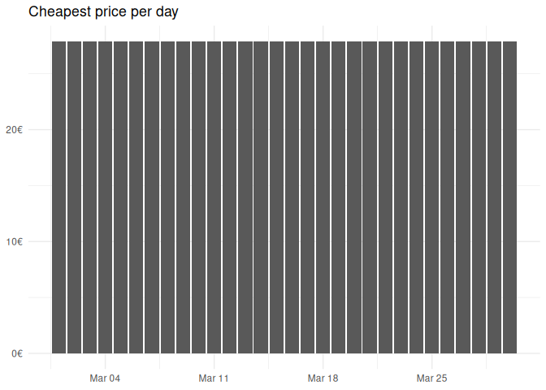
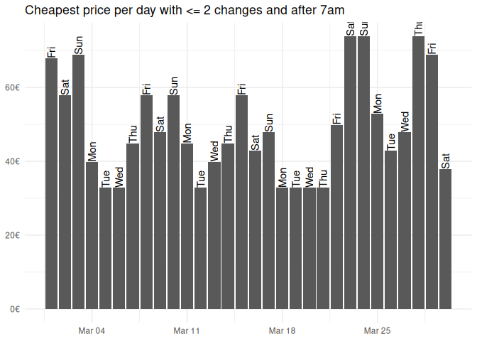

<!-- README.md is generated from README.Rmd. Please edit that file -->

# zugr

<!-- badges: start -->

[](https://lifecycle.r-lib.org/articles/stages.html#experimental)
<!-- badges: end -->

Just a small package that wraps the Fahrplan API of the German train
company [db](https://www.bahn.de). The main idea is to be able to cast
your net a bit wider in cases when you are flexible to go on a different
hour, day, or week.

**Note: I do not have time to actively develop this package. It should
be seen as a prototype. If you want to take it over as maintainer to
develop it futher, let me know**

## Installation

You can install the development version of zugr like so (or with
`remotes`, but the cool kids use `pak` now :grin:):

``` r
# install.packages("pak)
pak::pak("JBGruber/zugr")
```

## Example: When should I go to Amsterdam

A journey that I take often is from Wiesbaden to Amsterdam. There are
really fast connections between these cities, which is awsome! What is
less great is trying to decide if I go Monday or Tuesday, on the weekend
or during the week, or if I should rather go in a different week? If
you’ve used the interface of [bahn.de](https://www.bahn.de), you know
these decisions require a lot of useless click-work. Well not anymore…

The first step is to get the station ID for the main stations in
Wiesbaden and Amsterdam:

``` r
library(zugr)
wi <- search_station("Wiesbaden, Manteuffelstr. 5")
wi
#> # A tibble: 10 × 2
#>    name                                        id                               
#>    <chr>                                       <chr>                            
#>  1 Wiesbaden, Manteuffelstraße 5               A=2@O=Wiesbaden, Manteuffelstraß…
#>  2 Wiesbaden, Scheffelstraße 5                 A=2@O=Wiesbaden, Scheffelstraße …
#>  3 Wiesbaden - Delkenheim, Eifelstraße 5       A=2@O=Wiesbaden - Delkenheim, Ei…
#>  4 Wiesbaden - Mainz-Kostheim, Teufelssprung 5 A=2@O=Wiesbaden - Mainz-Kostheim…
#>  5 Wiesbaden, Reichsapfelstraße 5              A=2@O=Wiesbaden, Reichsapfelstra…
#>  6 Wiesbaden, Teufelsgraben                    A=2@O=Wiesbaden, Teufelsgraben@X…
#>  7 Wiesbaden, Scheffelstuben (Gastronomie)     A=4@O=Wiesbaden, Scheffelstuben …
#>  8 Wiesbaden, Eifelstraße                      A=2@O=Wiesbaden, Eifelstraße@X=8…
#>  9 Bad Kreuznach, Manteuffelstraße 4           A=2@O=Bad Kreuznach, Manteuffels…
#> 10 Scheffelstraße, Wiesbaden                   A=1@O=Scheffelstraße, Wiesbaden@…
```

The first one is what I need! Now Amsterdam. Here I don’t need as many
options:

``` r
adam <- search_station("Amsterdam", n_res = 2)
adam
#> # A tibble: 2 × 2
#>   name                       id                                                 
#>   <chr>                      <chr>                                              
#> 1 Amsterdam Centraal         A=1@O=Amsterdam Centraal@X=4899427@Y=52379191@U=80…
#> 2 Amsterdam, Centaurusstraat A=2@O=Amsterdam, Centaurusstraat@X=4884163@Y=52414…
```

Now I can make a search for next Tuesday Morning (as of writing this):

``` r
next_tuesday <- bahn_search(
  from = wi$id[1],
  to = adam$id[1],
  start = "2024-01-30T05:00:00",
  end =  "2024-01-30T19:00:00"
)
next_tuesday
#> # A tibble: 28 × 6
#>    id         duration             price changes start              
#>    <chr>      <Duration>           <dbl>   <int> <dttm>             
#>  1 4934becd_3 21720s (~6.03 hours)  93.4       4 2024-01-30 05:27:00
#>  2 a2c0662a_3 18600s (~5.17 hours) 113.        2 2024-01-30 06:19:00
#>  3 bfacedce_3 21960s (~6.1 hours)  103.        4 2024-01-30 06:29:00
#>  4 6ee9a9d4_3 23760s (~6.6 hours)   67.4       5 2024-01-30 06:29:00
#>  5 2fc08538_3 21960s (~6.1 hours)  113.        5 2024-01-30 06:59:00
#>  6 86175a2c_3 21600s (~6 hours)     93.4       3 2024-01-30 07:29:00
#>  7 a21cc91e_3 18600s (~5.17 hours) 113.        2 2024-01-30 08:19:00
#>  8 e62269ec_3 21960s (~6.1 hours)  103.        4 2024-01-30 08:29:00
#>  9 e7e3e886_3 23760s (~6.6 hours)   71.4       6 2024-01-30 08:29:00
#> 10 5466ce48_3 20760s (~5.77 hours) 103.        5 2024-01-30 08:49:00
#> # ℹ 18 more rows
#> # ℹ 1 more variable: end <dttm>
```

Note that the `end` parameter marks the time at which the train should
arrive at the latest, while `start` marks the earliest departure that
should be included in the results.

So what is the cheapest connection? Easy to see with some `R` commands
:smirk::

``` r
library(tidyverse)
next_tuesday |> 
  slice_min(price, n = 1) |> 
  select(-id)
#> # A tibble: 2 × 5
#>   duration            price changes start               end                
#>   <Duration>          <dbl>   <int> <dttm>              <dttm>             
#> 1 23760s (~6.6 hours)  67.4       5 2024-01-30 06:29:00 2024-01-30 13:05:00
#> 2 23760s (~6.6 hours)  67.4       6 2024-01-30 12:29:00 2024-01-30 19:05:00
```

With 5 connections and more than 6 hours, this is a rather terrible
connections. It is cheap though. Let’s see s quick visualisation
instead:

``` r
next_tuesday |> 
  # some connections include trains from different companies, the prices for
  # these are not oncluded
  filter(!is.na(price),
         !duplicated(start),
         start < "2024-01-30 11:00:00") |>
  ggplot(aes(x = start, y = price, label = changes, fill = duration)) +
  geom_col() +
  geom_text(aes(y = price / 2), colour = "white") +
  scale_y_continuous(labels = function(x) paste0(x, "€")) +
  scale_fill_gradient(labels = function(x) paste0(round(x / 60 / 60, 1), "h")) +
  labs(x = "depature", y = NULL, 
       title = "Prices and number of changes for different connections") +
  theme_minimal()
```


With more data, this gets a little more interesting.

``` r
february <- bahn_search(
  from = wi$id[1],
  to = adam$id[1],
  start = "2024-02-01T00:00:00",
  end =  "2024-03-01T23:59:59"
)
```

Let’s see which days would be especially cheap:

``` r
february |> 
  mutate(date = as.Date(start)) |> 
  group_by(date) |> 
  slice_min(price, n = 1) |> 
  ggplot(aes(x = date, y = price)) +
  geom_col() +
  labs(x = NULL, y = NULL, 
       title = "Cheapest price per day") +
  scale_y_continuous(labels = function(x) paste0(x, "€")) +
  theme_minimal()
```



This is all nice, but let’s only take into account connections I would
actually consider:

``` r
february |> 
  filter(changes <= 3) |> 
  mutate(date = as.Date(start),
         hour(start) > 5) |> 
  group_by(date) |> 
  slice_min(price, n = 1) |> 
  ggplot(aes(x = date, y = price)) +
  geom_col() +
  labs(x = NULL, y = NULL, 
       title = "Cheapest price per day with <= 3 changes") +
  scale_y_continuous(labels = function(x) paste0(x, "€")) +
  theme_minimal()
```



It also looks like historic searches are possible.

``` r
historic <- bahn_search(
  from = wi$id[1],
  to = adam$id[1],
  start = "2024-01-22T05:00:00",
  end =  "2024-01-22T19:00:00",
  parse = FALSE
)
```

I do not parse the results here to be able to explore the data a bit
more (parsing only extracts the information that I found intresting on
first glance). However, the results contain a message that the
connection is in the past and information about price and demand seem
absent.

``` r
historic[[1]][["verbindungen"]][[1]][["meldungenAsObject"]][[1]][["nachrichtLang"]]
#> [1] "Die gewählte Verbindung liegt in der Vergangenheit"
```
